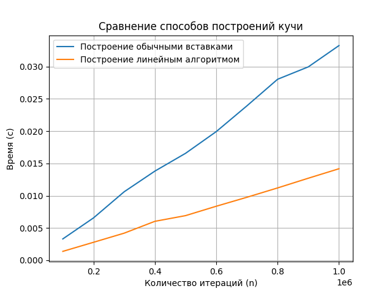

# Laba4

## Это четвертая лаба по алгосам на тему "Кучи"

### Как запустить (ну вдруг захотите):
```
make
make run
```

В функции main нужно прописывать какие кучи хотите запустить.

Пример:

```
testing("array_tests", HeapInsertion, "heapInsertion", 100000, 1000000, 100000);
```

#### Задание
Построить бинарную кучу размеров от 100000 до 1000000 элементов (шаг 100000):

1. Построить кучу линейным алгоритмом
2. Построить кучу обычными вставками



#### Вывод
Линейный алгоритм построения бинарной кучи работает значительно быстрее. Это видно из графика.

Алгоритм построения кучи за линию основан на последовательном вызове операции SiftDown для каждого элемента с номером от n до 1. Этот алгоритм работает за O(n) благодаря тому, что кучи, начиная с корня, уже корректны. Получается, каждый узел кучи, начиная с последнего узла, проверяется и при необходимости перестраивается. Этот процесс продолжается до корня кучи, обеспечивая корректность кучи на всех уровнях.

Алгоритм построения кучи путем последовательных вставок новых элементов с использованием операции sift_up работает за $O(log(n))$ времени. Это связано с тем, что каждый новый элемент сначала добавляется на последний уровень кучи, что может нарушить свойства кучи. Затем для восстановления кучи выполняется операция sift_up. Таким образом, общее время выполнения для всех $n$ операций вставки составляет $O(n \cdot log(n))$ .
