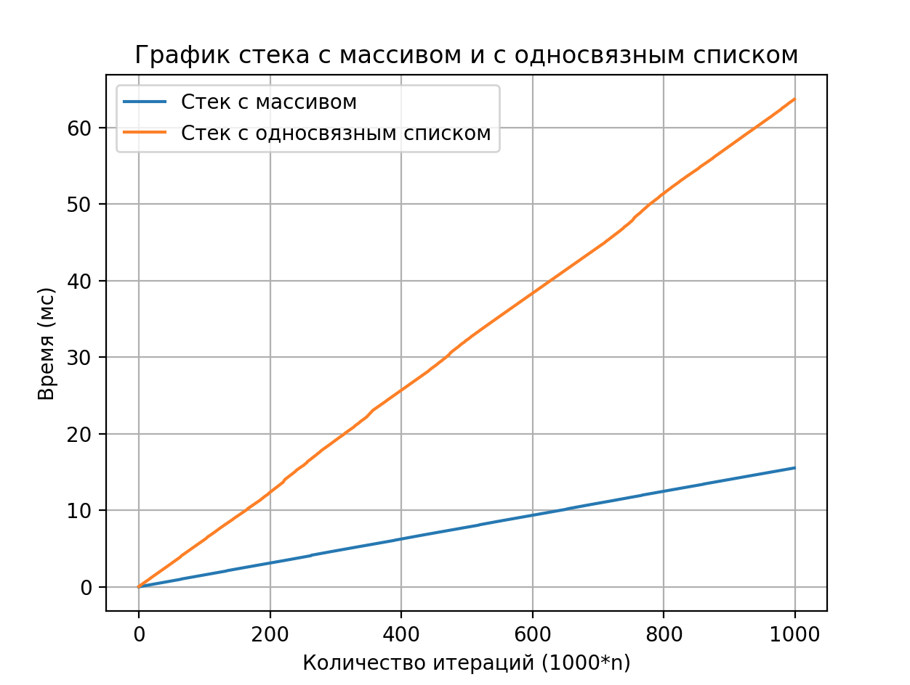
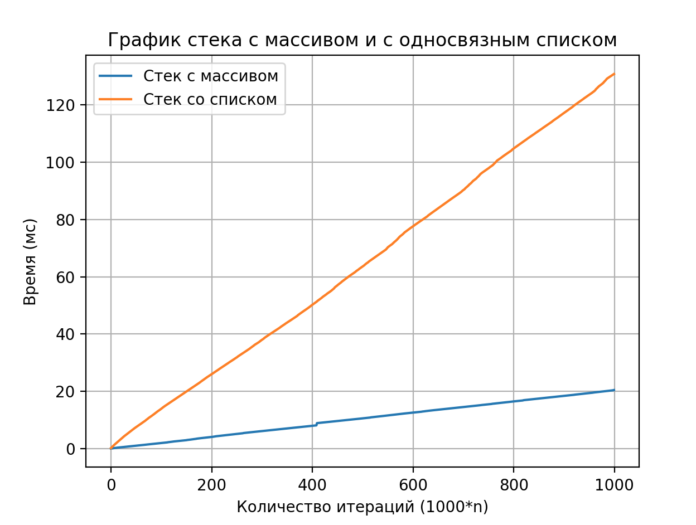

# Laba2

#### Это вторая лаба по алгосам на тему "Сравнение скорости работы динамического массива и односвязного списка"

### 0. Program launch
Чтобы запустить программу нужно перейти в папку (например Array), (в какжой папке находится свой стек)
```
cd Array
```
#### Далее
```
make clean
make
make run
```

Если хотите изменить выполнение команды для void* (в репозитории по умолчанию лежит int), то заменить в Makefile SOURCES на
```
SOURCES = main.c mainArrayVoid.c stackArrayVoid.c ../log.c
```

### Введение
Я сначала сделала массивы на
```
typedef int Elem_t
```
После переделала стек так, чтобы он хранился на адресах разных типов. Я не удаляла файлы, сделанные с int, потому что интересно сравнить, как меняется скорость работы в зависимости от одного типа и разных типов на адресах.


### Тест 1
Нужно было запушить 10^6 интов, потом удалить половину элементов и запушить четверть - останется 750000 интов. Повторять удаление половины и вставку четверти, пока не останется в стеке меньше 100000 элементов (получится 9 итераций).

У меня получились такие результаты:
________
```
typedef int Elem_t
Среднее время работы стека на динамическом массиве: 0.045057 секунд

Среднее время работы стека на односвязном списке: 0.473346 секунд
```

________
```
void*
Среднее время работы стека на динамическом массиве: 0.600371 секунд

Среднее время работы стека на односвязном списке: 0.996535 секунд
```

На односвязном списке получилось в 10 раз дольше(((((

### Тест2
Нужно было запушить 10^6 интов, потом 100 раз удалить 10000 элементов и добавить столько же. Далее как в первом тесте провести 9 итераций удаления-вставки и снова 100 раз удалить 10000 элементов и добавить столько же.
У меня получились такие результаты:
```
typedef int Elem_t
Среднее время работы стека на динамическом массиве: 0.054669 секунд

Среднее время работы стека на односвязном списке: 0.759389 секунд
```

```
void*
Среднее время работы стека на динамическом массиве: 0.878495 секунд

Среднее время работы стека на односвязном списке: 1.673301 секунд
```

Тут разница во времени в кол-во раз еще больше...


### Тест3
Нужно было научиться средствами языка генерировать случайные числа из множества {1,2}. Далее сначала довести размер стека до миллиона, а потом выполнить миллион инструкций следующего вида: каждое выпадение единицы добавлять элемент, а на двойку - попать из стека.
У меня получились такие результаты:
```
typedef int Elem_t
Среднее время работы стека на динамическом массиве: 0.020081 секунд

Среднее время работы стека на односвязном списке: 0.065225 секунд
```

```
void*
Среднее время работы стека на динамическом массиве: 0.072481 секунд

Среднее время работы стека на односвязном списке: 0.139372 секунд секунд
```

Тут уже список плох в 3~5 раз, но все равно грустно((

### Тест4
Нужно было построить график time(n), где n - число вставок для стека на массиве. n итерировать с шагом 1000 от 1000 до 10^6.

Я решила отобразить на графике время выполнение этого теста на односвязном списке и на динамическом массиве (typedef int Elem_t).



График времени выполнения этого теста на односвязном списке и на динамическом массиве (void*).



Также я решила замерить время работы этого теста динамического массива с использованием Realloc и без (то есть сразу выделять большое количество памяти).


Без Realloc работает быстрее.

### Почему такая разница во времени?
Динамический массив на обычном однотипном массиве (например, int) хранит свои элементы в непрерывной области памяти. Когда происходит обращение к элементу по индексу, процессор имеет более простой доступ к соседним элементам из-за локальности данных.

В односвязном списке каждый узел может быть расположен в произвольном месте памяти, из-за чего доступ к элементу по индексу требует прохода через указатели от головы списка.

### Вывод
Что же хочется сказать? По графику видно, что стек на динамическом массиве оЧеВиДнО работает быстрее. Так что лучше делать стек, как по мне, на динамическом массиве (но все-таки с Realloc, чтобы никогда не задумываться над возможным размером).

Также напишу про несколько преимуществ динамического массива (мое мнение):
- стек как будто бы намного проще писать
- можно просто реалочить
- очевидно по времени быстрее

Недостатки:
- если делать с realloc, то в моменты (capacity == size || size = capacity / 2) эти операции могут дорого стоить, ведь нам сначало нужно увеличить/уменьшить массив

Преимущества односвязного списка:
- размер не ограничен (сверху)

Недостатки:
- как по мне, то реализация сложнее
- если я вдруг захочу обратиться к произвольному элементу в стеке, то это будет очень долго (за O(n), хотя в массиве за O(1))

Еще про их разницу:
 - В динамическом массиве доступ к элементу по индексу - O(1), так как можно обратиться к ячейке памяти по индексу.

- В односвязном списке доступ к элементу по индексу - O(n), так как необходимо последовательно обойти каждый узел, начиная с головы, чтобы добраться до нужного элемента.

Еще парочку замечаний:
- В первой реализации стека используется массив указателей void** data, что может привести к более эффективному использованию кешa (свой кэш и защиту я здесь не писала((). Во второй реализации каждый узел struct Node может храниться в разных областях памяти, что может привести к большему количеству кешовых промахов.

- В первой реализации управление памятью происходит более простым способом - выделение массива указателей, а не отдельного блока памяти для каждого узла.

- Размер структуры данных влияет на распределение памяти. В первой реализации структура данных меньше, чем во второй, что может привести к лучшему распределению памяти.

**В общем и целом, динамический массив обычно работает быстрее односвязного списка засчет лучшей локальности данных и эффективного доступа к элементам по индексу.**


