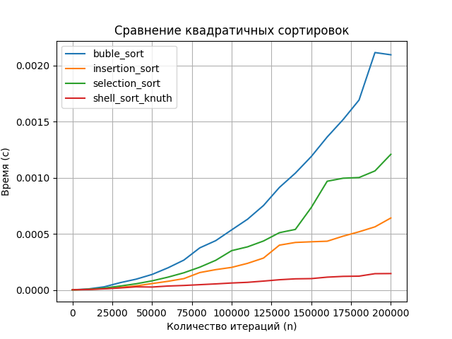
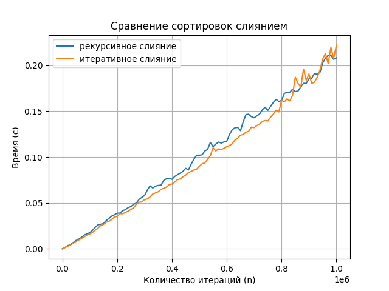
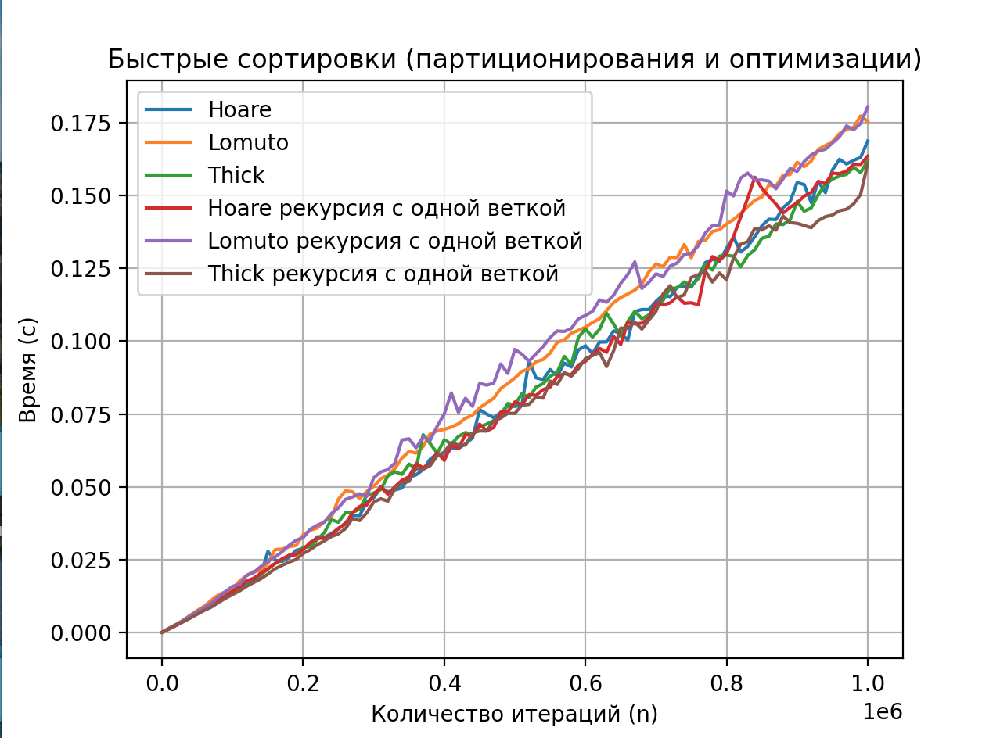
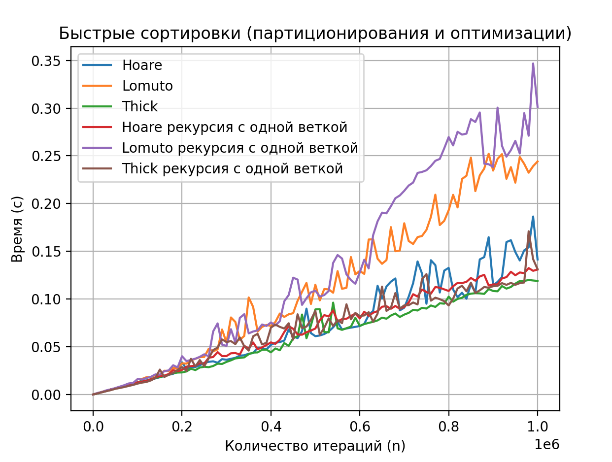
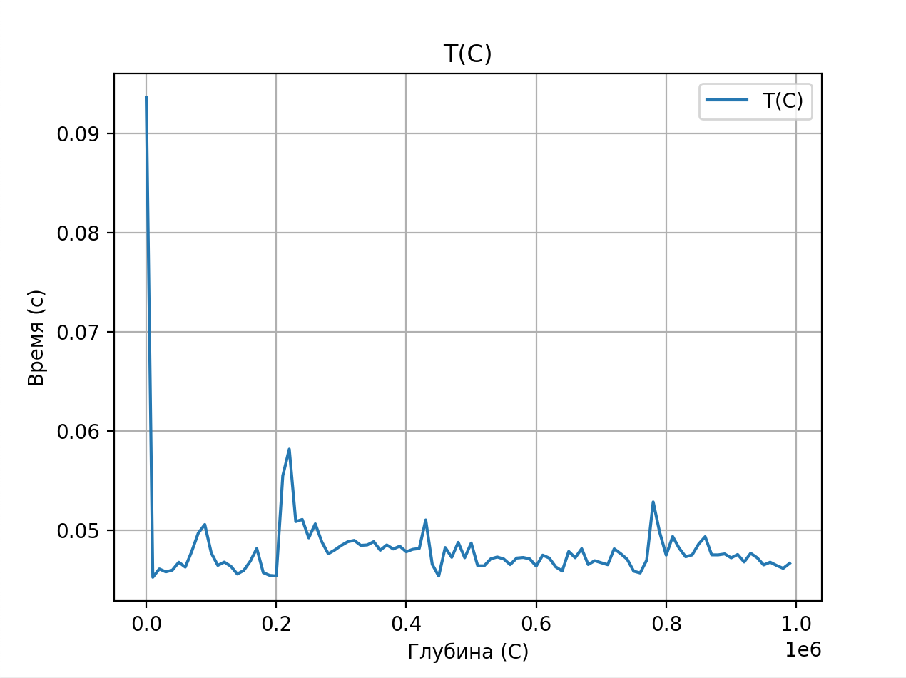
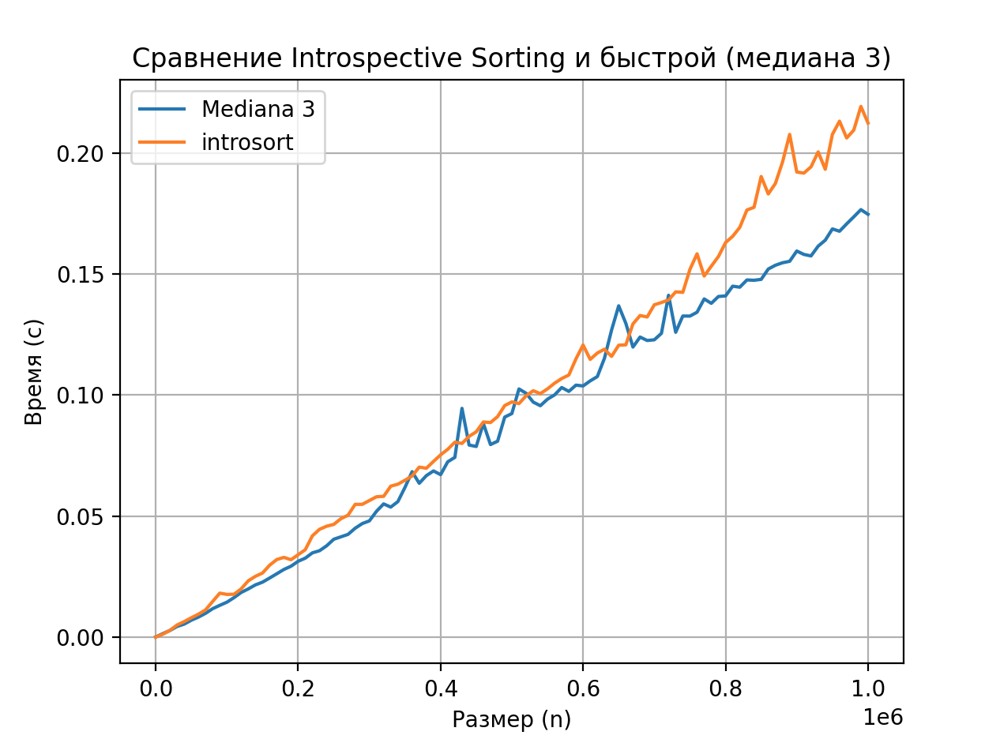
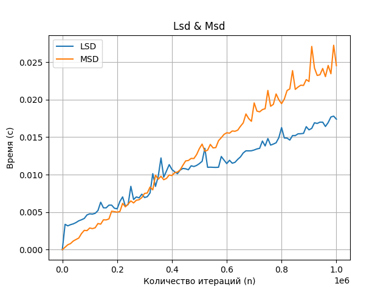
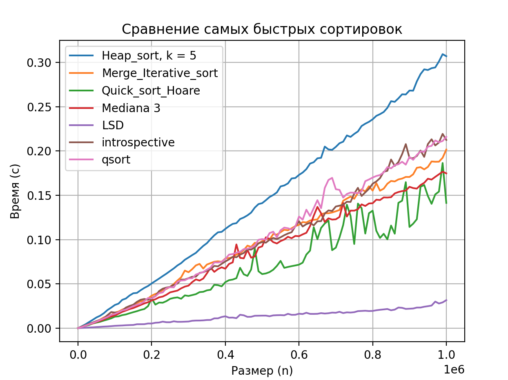

# Laba3

## Это третья лаба по алгосам на тему "Cравнение сортировок"

### Как запустить:
```
make
make run
```

В функции main нужно прописывать какие сортировки нужно запустить.

Пример:

```
testing("big_tests", LSDsort, "big_tests_q", "LSD", 0, 1000000, 10000, 1);
```

Папки "big_tests" и "test_most_dublicates" лежат здесь: [тык](https://drive.google.com/drive/folders/1jT0Etvr9tJS8dALWOEGAL4YT1s9mQ_JX?usp=sharing)

### Пункт 1
**Задание** - написать 4 квадратичные сортировки:
- вставками
- пузырьком
- выбором
- сортировка Шелла (в качестве стратегии для выбора шагов используйте последовательность, которую предложил Кнут)

Сравнить сортировки на наборе массивов small_tests.

**Результат**:



**Вывод**: сортировка Шелла работает быстрее других сортировок на данном наборе данных. Это можно объяснить тем, что сортировка Шелла использует последовательность шагов, которая позволяет быстро уменьшить количество неупорядоченных элементов в массиве. Кроме того, сортировка Шелла имеет лучшую асимптотическую сложность в среднем случае (примерно $O(n^{1.3})$) по сравнению с квадратичной сложностью других сортировок.

### Пункт 2
**Задание** - написать пирамидальную сортировку, основанную на k-ичной куче.

Сравнивать сортировки на наборе массивов big_tests.

**Результат**:


**Вывод**: результаты показали, что наиболее оптимальными оказались значения $k = 4$ и $k = 5$. Эти значения обеспечивают лучшее время выполнения сортировки на данном наборе данных.Этот может быть объяснен тем, что $k = 4$ и $k = 5$ обеспечивают баланс между количеством сравнений и количеством обменов элементов в куче. Слишком маленькие значения $k$ могут привести к увеличению количества обменов, тогда как слишком большие значения $k$ могут увеличить количество сравнений, что также может повлиять на производительность.

### Пункт 3
**Задание** - написать рекурсивную версию сортировки слиянием. Написать итеративную версию сортировки слиянием. Сравнить на наборе данных big_tests.

**Результат**



**Вывод**: Итеративная работает лучше. Она не использует рекурсию и, следовательно, не требует использования стека вызовов, поэтому, мне кажется, что это может уменьшить нагрузку на память и предотвратить переполнение стека для больших массивов.

### Пункт 4
Написать 3 вида партиционирования и быстрые сортировки (в качестве опорного центральный элемент сортируемого отрезка), использующие:
- Ломуто
- Хоара
- Толстое разбиение

**Результаты** (big_tests)



**Результаты** (test_most_dublicates)



**Вывод** По результатам тестирования на наборе данных big_tests, обнаружено, что сортировка Хоара с рекурсией, Хоара без рекурсии, Толстое разбиение и Толстое разбиение с рекурсией показали примерно одинаковую производительность и оказались быстрее, чем сортировка Ломуто и Ломуто с рекурсией. На наборе данных test_most_dublicates наблюдается аналогичная тенденция: сортировка Хоара с рекурсией, Хоара, Толстое разбиение и Толстое разбиение с рекурсией работают примерно одинаково быстро и превосходят сортировку Ломуто и Ломуто с рекурсией.

### Пункт 5
**Задание** - сравнить на наборе данных big_tests следующие стратегии выбора pivot (в качестве базовой сортировки я взяла быструю сортировку, использующую Хоара):
- Центральный элемент
- Медиана 3
- Случайный элемент
- Медиана трех случайных

**Результат**


**Вывод**: медиана 3 и центральный элемент будто бы работают лучше. Думаю, это связано с тем, что это позволяет избежать выбора чрезмерно маленького или большого значения в качестве опорного (если говорить про рандомные элементы).
Также медиана 3 не зависит от случайных факторов, в отличие от стратегии выбора случайного элемента. Это позволяет избежать некоторых неопределенностей, связанных с случайным выбором, и обеспечить более последовательные результаты на разных наборах данных. Центральный элемент более предсказуемый, так как основан на более систематическом подходе к разделению массива на две части.

### Пункт 6
**Задание** - подобрать оптимальный размер сортируемого блока малого размера для сортировки Шелла. В качестве второй сортировки самую быструю из всех быстрых сортировок (Шелла). Сравнить на very_small_test сортировки.

**Результат**


На графике ниже лучше видно, что при блоке 9 сортировка Шелла становится быстрее быстрой.

**Вывод**: Получилось, что 9 - оптимальный размер


### Пункт 7
**Задание** - написать интроспективную сортировку, которая использует:
- Оптимальную квадратичную сортировку для малых блоков (Шелл с Кнутом)
- Пирамидальную сортировку с оптимальным k = 5, когда рекурсия достигает глубины С, оптимальный коэффициент С подобрать экспериментально (также построить график $T(C)$ ).

Сравнить интроспективную сортировку с самой удачной быстрой сортировкой из пункта 5 (медиана 3).

**Результат**



Экспериментально получилось, что при глубине 16, лучше делать переход на пирамидальную сортировку.



**Вывод**: Интроспективная немного дольше самой быстрой. Мне кажется, интроспективная сортировка обычно считается эффективной, она может работать немного хуже в данном случае из-за того, что использованный метод сортировки (шелл и кнут) для малых блоков может быть несколько менее эффективным.

### Пункт 8
**Задание** - реализовать  Least Significant Digit Sort и Most Significant Digit Sort по байтам.

**Результат**



**Вывод**: как будто бы они работают +- одинаково.

### Пункт 9
**Вывод**



Работа выполнялась на CPU -> 2,5 GHz 4‑ядерный процессор Intel Core i7

Я честно очень старалась. У меня в принципе получилось написать сортировки, которые быстрее, чем stdlib qsort. Правда heapsort все-таки долгая получилась.

Вообще лаба интересная, но жесть долгая...

Каждый алгоритм вот с такой вот асимптотикой:

1. heap_sort:
   - Асимптотика:
     - Худший случай: O(n log n)
     - Лучший случай: O(n log n)
     - Средний случай: O(n log n)

2. merge sort (итеративная):
   - Асимптотика:
     - Худший случай: O(n log n)
     - Лучший случай: O(n log n)
     - Средний случай: O(n log n)

3. QuickSort на основе метода Хоара:
   - Асимптотика:
     - Худший случай: O(n^2)
     - Лучший случай: O(n log n)
     - Средний случай: O(n log n)

4. Быстрая сортировка с выбором медианы из трех элементов:
   - Асимптотика: Примерно та же, что и у обычной QuickSort, но с некоторыми оптимизациями по выбору пивота, что может улучшить производительность в худшем случае.

5. LSD (Least Significant Digit) сортировка:
   - Асимптотика:
     - Худший случай: O(n * w)
     - Лучший случай: O(n * w)
     - Средний случай: O(n * w)
     - Где w - это количество байтов в каждом элементе.

6. Интросорт (смесь QuickSort и HeapSort):
   - Асимптотика:
     - Худший случай: O(n log n)
     - Лучший случай: O(n log n)
     - Средний случай: O(n log n)

7. Быстрая сортировка (Quick Sort):
    - Асимптотика:
      - Худший случай: O(n^2)
      - Лучший случай: O(n log n)
      - Средний случай: O(n log n)

Вообще, могу сказать одно: LSD ТОП!!!!!!

А вообще сортировки могут зависеть от многих факторов - от типа данных, объема входных данных, так что каждая сортировка в чем-то хороша.

Больше всего мне нравится bubble_sort, потому что ее очень легко писать))
