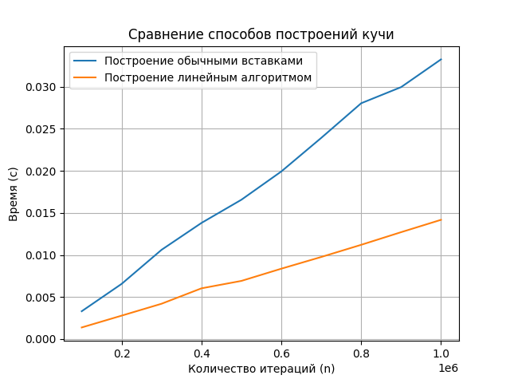

# Laba4

## Это четвертая лаба по алгосам на тему "Кучи"

### Как запустить (ну вдруг захотите):
```
make
make run
```

В функции main нужно прописывать какие кучи хотите запустить.

Пример:

```
testing("array_tests", HeapInsertion, "heapInsertion", 100000, 1000000, 100000);
```

#### Задание
Построить бинарную кучу размеров от 100000 до 1000000 элементов (шаг 100000):

1. Построить кучу линейным алгоритмом
2. Построить кучу обычными вставками



#### Вывод
Линейный алгоритм построения бинарной кучи работает значительно быстрее. Это видно из графика.

##### Построение за линию
Алгоритм построения кучи, основанный на последовательном вызове операции sift_down для каждого элемента с номером от n до 1 с шагом k = 2 (кратность кучи), работает за $O(n)$ времени. Это возможно благодаря тому, что кучи, начиная с корня, уже корректны, и мы можем восстанавливать кучи для поддеревьев снизу вверх, начиная с элемента с номером k+1.

Пусть в массиве $a[0]$ − корень дерева, а потомки элемента $a[i]$ - это ($a[d_i+1]...a[d_i+d]$) (это для количества детей - d штук, в нашем случае потомки $a[i \cdot 2 + 1], a[i \cdot 2 + 2]$). Делаем $siftDown$ для вершин, имеющих хотя бы одного потомка: от $\frac{n}{d}$ до 0 (в нашем случае $\frac{n}{2}$ до 0),— поддеревья, состоящие из одной вершины без потомков, уже упорядочены. Мы фактически начинаем с узлов, у которых начинаются листья дерева, и продолжаем до корня. Листья не имеют потомков, и поэтому они уже удовлетворяют свойству кучи, так как узлы без потомков можно считать кучей, удовлетворяющей свойству кучи.

На выходе получим искомую кучу.

До вызова $siftDown$ для вершины, ее поддеревья являются кучами. После выполнения $siftDown$ эта вершина с ее поддеревьями будут также являться кучей. Значит, после выполнения всех $siftDown$ получится куча.


##### Построение вставками за $O(n \cdot \log n)$

Алгоритм построения кучи путем последовательных вставок новых элементов с использованием операции sift_up работает за $O(\log(n))$ времени. Это связано с тем, что каждый новый элемент сначала добавляется на последний уровень кучи, что может нарушить свойства кучи. Затем для восстановления кучи выполняется операция sift_up. Таким образом, общее время выполнения для всех $n$ операций вставки составляет $O(n \cdot \log(n))$ .
