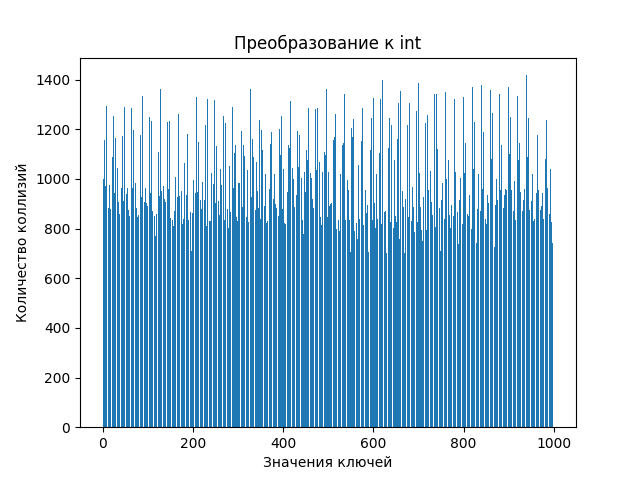

# Laba5

## Это пятая лаба по алгосам на тему "Исследование Хэш-Функций"

### Целые числа (unsigned int)

#### Пункт 1 (unsigned int)
Сгенерировать числа из равномерного распределения [0, RANDMAX]

Построите столбчатые диаграммы коллизий для следующих хэш-функций:

1. Остаток от деления
2. Битовое представление
3. Метод умножения с константой, предложенной Кнутом

Результаты:

1. Хэш-функция - остаток от деления

2. Хэш-функция - битовое представление

1. Хэш-функция - метод умножения с константой, предложенной Кнутом

#### Вывод:
1. Остаток от деления - очень простая хэш-функция, но она приводит к большому количеству коллизий.
2. Битовое представление - если равномерно распределены ключи, то по идее вери вел хэш-функция.
3. Метод умножения с константой - вполне рабочая хэш-функция, если размер таблицы будет в соотношении с кол-во ключей 0.7.

НООООО, у меня они получились примерно все одинаковые, так как хэщ-таблица перегружена. (LOAD FACTOR 0.001)

#### Пункт 2 (float)
Сгенерировать числа из равномерного распределения [-10; 10].

Построите столбчатые диаграммы коллизий для следующих хэш-функций:
1. Преобразование к (int) c последующим взятием битого представления инта
2. Битовое представление
3. Извлечение мантиссы
4. Извлечение экспоненты
5. Произведение мантиссы на экспоненту

Результаты:

будет представлять собой число в диапазоне от 0 до 9.

