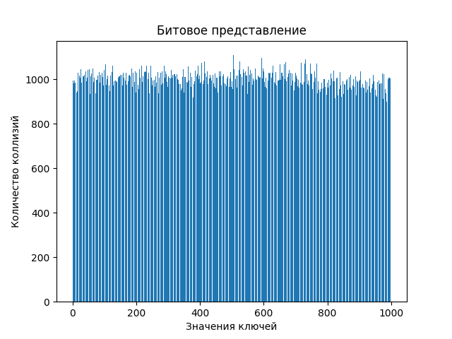
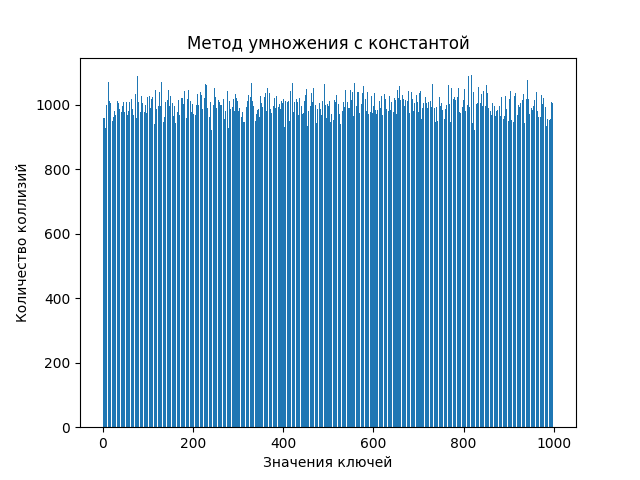
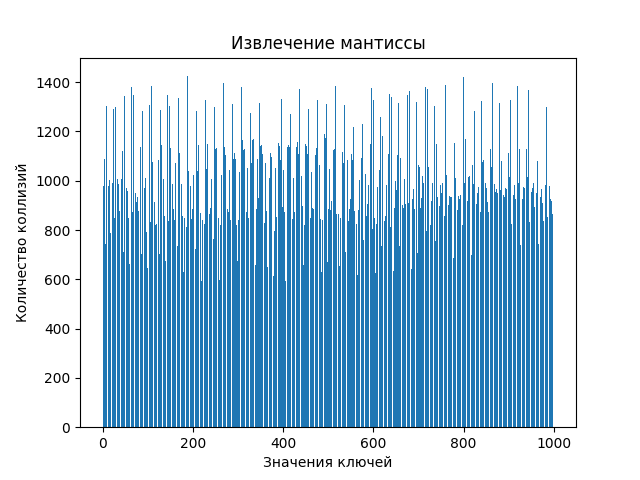
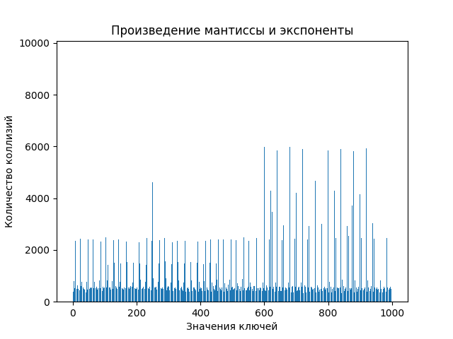
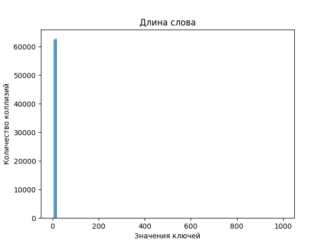
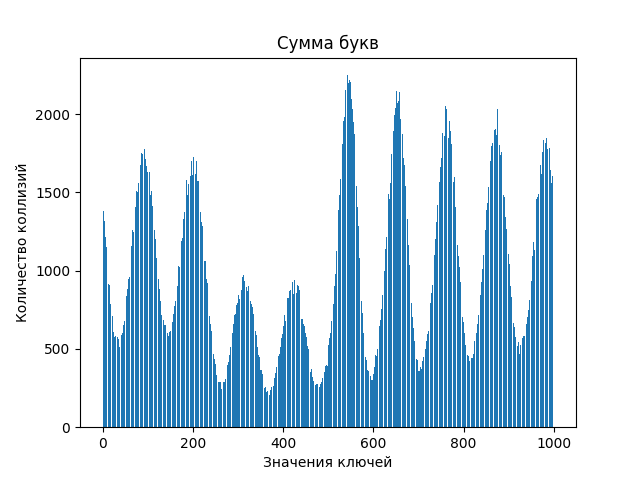
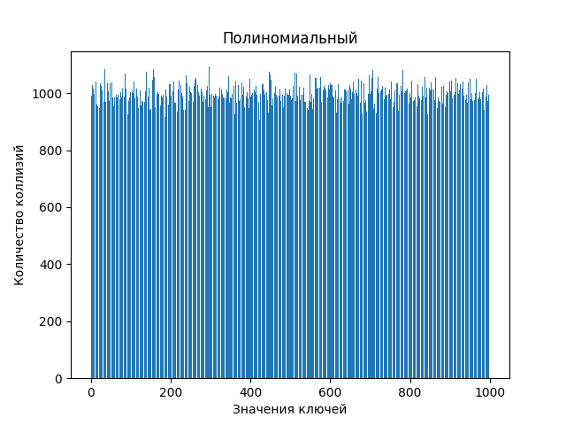
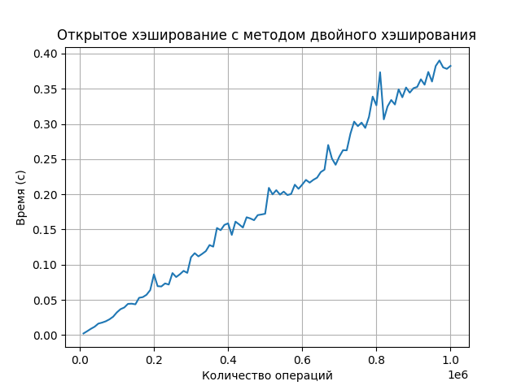

# Laba5

## Это пятая лаба по алгосам на тему "Исследование Хэш-Функций"

### Исследование хэш-функций

#### Unsigned int
Сгенерировать числа из равномерного распределения [0, RANDMAX]

Построить столбчатые диаграммы коллизий для следующих хэш-функций:

1. Остаток от деления
2. Битовое представление
3. Метод умножения с константой, предложенной Кнутом

Результаты:

1. Хэш-функция - остаток от деления

2. Хэш-функция - битовое представление

1. Хэш-функция - метод умножения с константой, предложенной Кнутом

#### Вывод:
1. Остаток от деления - очень простая хэш-функция, но она приводит к большому количеству коллизий.
2. Битовое представление - если равномерно распределены ключи, то по идее вери вел хэш-функция.
3. Метод умножения с константой - вполне рабочая хэш-функция, если размер таблицы будет в соотношении с кол-во ключей 0.7.

НООООО, у меня они получились примерно все одинаковые, так как хэщ-таблица перегружена. (LOAD FACTOR 0.001)

#### Float
Сгенерировать числа из равномерного распределения [-10; 10].

Построить столбчатые диаграммы коллизий для следующих хэш-функций:
1. Преобразование к (int) c последующим взятием битого представления инта
2. Битовое представление
3. Извлечение мантиссы
4. Извлечение экспоненты
5. Произведение мантиссы на экспоненту

Результаты:
1. Хэш-функция - преобразование к (int) c последующим взятием битого представления инта

2. Хэш-функция - битовое представление

Time taken by hash_bitwise: 0.100475 seconds

3. Хэш-функция - извлечение мантиссы

4. Хэш-функция - извлечение экспоненты

5. Хэш-функция - произведение мантиссы на экспоненту

 

Выводы:
1. Преобразование к int и взятие битового представления - плохая хэш-функция для размера хэш-таблицы 1000. Потому что когда мы берем остаток по размеру хэш-таблицы, то получаем только 8 возможных распределений {0, 1, 10, 11, 100, 101, 110, 111}.

2. Битовое представление аналогично 1

3. Хэш-функция извлечение мантиссы проявляется себя уже лучше, так как мантисса(дробная часть) принимает по модулю размера хэш-таблицы все возможные значения.

4. Хэш-функция извлечение экспоненты ведет себя плохо. Диапазон представимых значений экспоненты в стандарте IEEE 754 для чисел с плавающей запятой одинарной точности составляет от -126 до 127. В нашем случае числа в отрезке [-10, 10]. Поэтому диапазон значений экспоненты [111, 130] (127 не вычиталось).

5. Хэш-функция извлечение экспоненты произведение мантиссы на экспоненту может привести к хорошей равномерности распределения хэшей, если числа имеют различные мантиссы и экспоненты.

#### String

Сгенерировать строки случайной длины от 5 до 20 символов, из случайных малых букв английского алфавита.

Построить столбчатые диаграммы коллизий для следующих хэш-функций:
1. Длина строки
2. Сумма букв
3. Полиномиальный
4. crc32

Результаты:

1. Длина строки

2. Сумма букв

3. Полиномиальный

4. crc32

Выводы:

1. Хэш-функция длина строки не имеет равномерное распределение хэшей, так как одинаковые длины строк приводят к коллизиям.

2. Хэш-функция суммы кодов символов в строке имеет к коллизиям, особенно для строк разной длины, но с одинаковой суммой кодов символов.

3. Хэш-функция полиномиальная менее склонна к коллизиям. (если взять размер таблицы больше 1000, то very good)

4. Хэш-функция CRC32 (легенда) обеспечивает goood распределение хэшей и обладает низкой вероятностью коллизий.

### Сравнение хэш-таблиц

Реализуем следующие таблицы:
1. Хэширование цепочками
2. Хэш-таблица с использованием открытого хэширования с линейным хэшированием
3. Хэш-таблица с использованием открытого хэширования с квадратичным хэшированием
4. Хэш-таблица с использованием открытого хэширования с методом двойного хэширования

#### Зависимость времени работы хэш-таблицы от выбранного load_factor

Будем делать 1млн вставок чисел типа int.

1. Хэширование цепочками

При load factor = 0.6 начинает расти время выполнение программы. Так что при заселенности 0.6 будем делать рехэширование.

2. Хэш-таблица с использованием открытого хэширования с линейным тестированием

При load factor = 0.7 получилось, что время выполнения программы начинает расти. Так что при заселенности 0.7 будем делать рехэширование.

3. Хэш-таблица с использованием открытого хэширования с квадратичным тестированием

При load factor = 0.75 получилось, что время выполнения программы начинает расти. Так что при заселенности 0.75 будем делать рехэширование.

4. Хэш-таблица с использованием открытого хэширования с методом двойного хэширования

При load factor = 0.7 получилось, что время выполнения программы начинает расти. Так что при заселенности 0.7 будем делать рехэширование.

#### Равновероятностные операции

Сгенерируем случайную последовательность операций с хэш-таблицей (вставка, поиск, удаление), все операции равновероятные.

#### Неравновероятностные операции

Вывод: Различные хэш-таблицы проявляют себя по-разному в зависимости от нагрузки и типа операций.

В случае, когда вероятность вставки равна 0.5, а вероятности удаления и поиска равны 0.25 каждая, хэш-таблицы также проявляют различное поведение в зависимости от размера таблицы. Увеличение размера таблицы приводит к увеличению времени выполнения операций.

Лучший load factor = 0.7

### Сравнение идеального хэширования с обычным

Строим три хэш таблицы из случайного набора на 100000 различных чисел типа int:

1. Хэш-таблица с методом цепочек
2. Хэш-таблица с использованием открытого хэширования с квадратичным тестированием
3. Хэш-таблица, использующая идеальное хэширование

Сделаем 10 млн. запросов поиска к каждой из хэш-таблиц.

|               Хэш-таблица                | Время, затраченное на 1млн запросов поиска (с) |
|:----------------------------------------:|:----------------------------------------------:|
| Хэш-таблица с методом цепочек            |                1.446842                        |
| Хэш-таблица с квадратичным хэшированием  |                0.939007                        |
| Хэш-таблица с идеальным хэшированием     |                0.832594                        |

Вывод:
Результаты эксперимента показывают, что хэш-таблица с идеальным хэшированием быстрее отвечает на запросы поиска при выполнении 10 миллионов запросов поиска.

Следовательно, при работе с большим объемом данных идеальное хэширование -> very good

### Вывод

Я усталь...

Идеальное хэширвание реально идеальное, но по реализации не самое простое. Хэш-таблица с квадратичным тестированием не сильно отстает от идеального, так что при реализации как будто бы проще даже им пользоваться. Метод цепочек чего-то оказался very bad, хотя и ожидаемо, ведь он использует листы, в которых чтобы дойти до какого-то элемента нужно пройтись в худшем случае по list.size- 1 элементу. В общем то **я устала это писать**.
