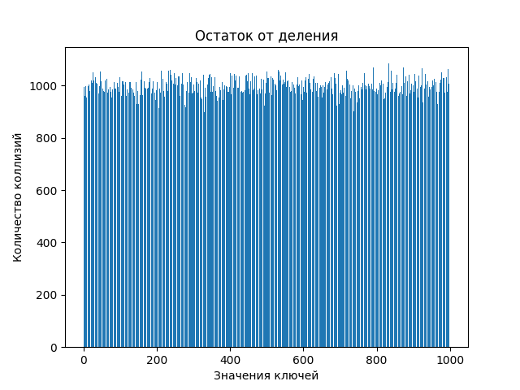
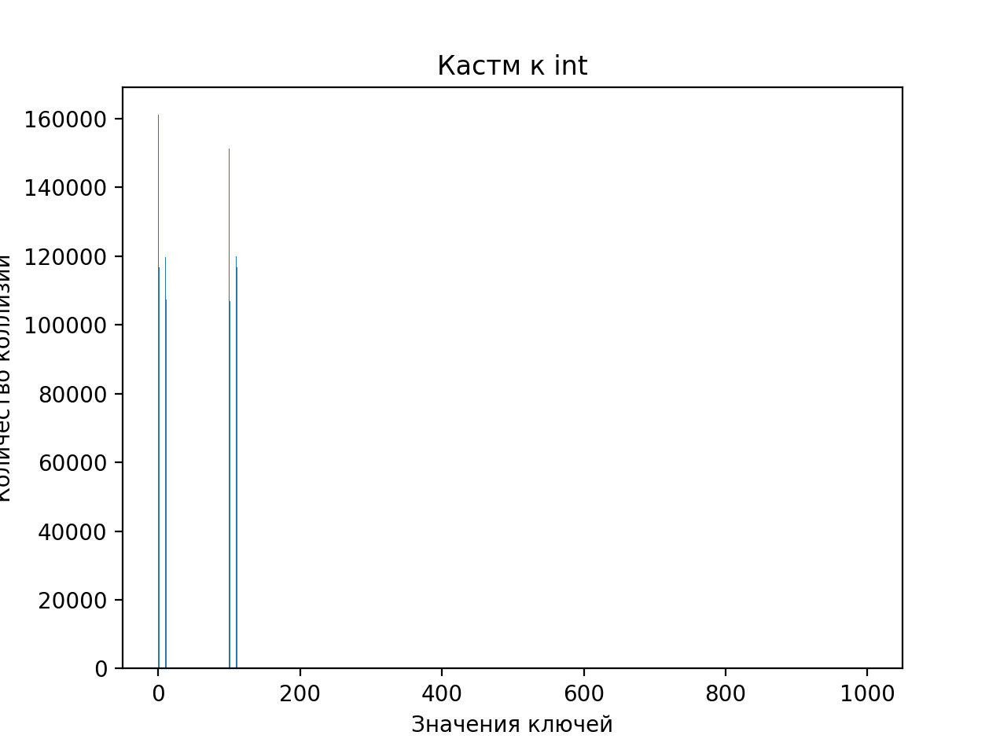
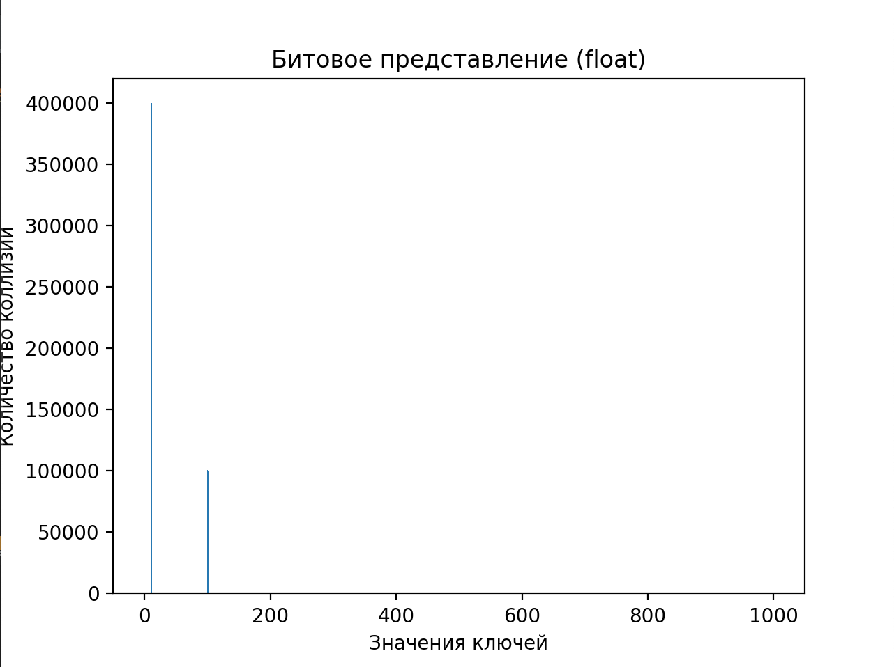
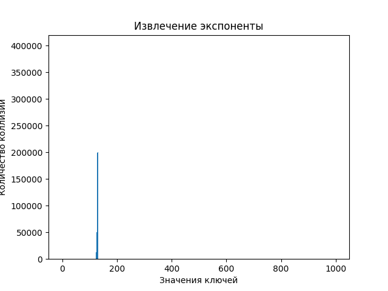
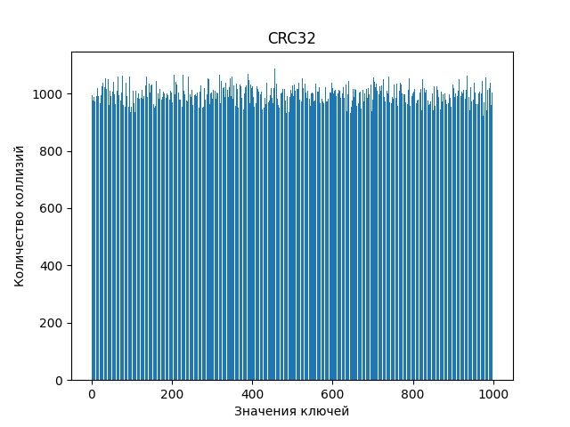
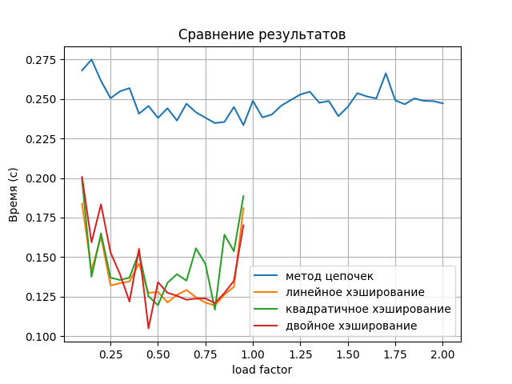
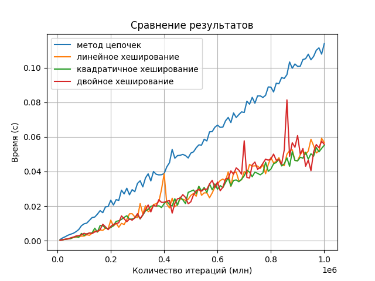
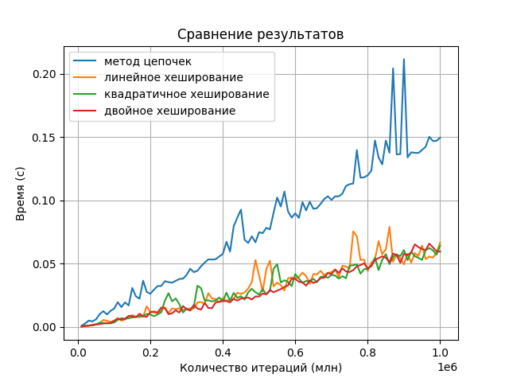

# Laba5

## Это пятая лаба по алгосам на тему "Исследование Хэш-Функций"

### Исследование хэш-функций

#### Unsigned int
Сгенерировать числа из равномерного распределения [0, RANDMAX]

Построить столбчатые диаграммы коллизий для следующих хэш-функций:

1. Остаток от деления
2. Битовое представление
3. Метод умножения с константой, предложенной Кнутом

Результаты:

1. Хэш-функция - остаток от деления

2. Хэш-функция - битовое представление

1. Хэш-функция - метод умножения с константой, предложенной Кнутом

#### Вывод:
1. Остаток от деления - очень простая хэш-функция, но она приводит к большому количеству коллизий.
2. Битовое представление - если равномерно распределены ключи, то по идее вери вел хэш-функция.
3. Метод умножения с константой - вполне рабочая хэш-функция, если размер таблицы будет в соотношении с кол-во ключей 0.7.

НООООО, у меня они получились примерно все одинаковые, так как хэш-таблица перегружена. (LOAD FACTOR 1млн/1т = 1000)

#### Float
Сгенерировать числа из равномерного распределения [-10; 10].

Построить столбчатые диаграммы коллизий для следующих хэш-функций:
1. Преобразование к (int) c последующим взятием битого представления инта
2. Битовое представление
3. Извлечение мантиссы
4. Извлечение экспоненты
5. Произведение мантиссы на экспоненту

Результаты:
1. Хэш-функция - преобразование к (int) c последующим взятием битого представления инта

2. Хэш-функция - битовое представление

Time taken by hash_bitwise: 0.100475 seconds

3. Хэш-функция - извлечение мантиссы

4. Хэш-функция - извлечение экспоненты

5. Хэш-функция - произведение мантиссы на экспоненту

 

Выводы:
1. Преобразование к int и взятие битового представления - плохая хэш-функция для размера хэш-таблицы 1000. Потому что когда мы берем остаток по размеру хэш-таблицы, то получаем только 8 возможных распределений {0, 1, 10, 11, 100, 101, 110, 111}.

2. Битовое представление аналогично 1

3. Хэш-функция извлечение мантиссы проявляется себя уже лучше, так как мантисса(дробная часть) принимает по модулю размера хэш-таблицы все возможные значения.

4. Хэш-функция извлечение экспоненты ведет себя плохо. Диапазон представимых значений экспоненты в стандарте IEEE 754 для чисел с плавающей запятой одинарной точности составляет от -126 до 127. В нашем случае числа в отрезке [-10, 10]. Поэтому диапазон значений экспоненты [111, 130] (127 не вычиталось).

5. Хэш-функция извлечение экспоненты произведение мантиссы на экспоненту может привести к хорошей равномерности распределения хэшей, если числа имеют различные мантиссы и экспоненты.

#### String

Сгенерировать строки случайной длины от 5 до 20 символов, из случайных малых букв английского алфавита.

Построить столбчатые диаграммы коллизий для следующих хэш-функций:
1. Длина строки
2. Сумма букв
3. Полиномиальный
4. crc32

Результаты:

1. Длина строки

2. Сумма букв

3. Полиномиальный

4. crc32

Выводы:

1. Хэш-функция длина строки не имеет равномерное распределение ключей по хэш-таблице, так как одинаковые длины строк приводят к коллизиям.

2. Хэш-функция суммы кодов символов в строке имеет к коллизиям, особенно для строк разной длины, но с одинаковой суммой кодов символов.

3. Хэш-функция полиномиальная менее склонна к коллизиям. (если взять размер таблицы больше 1000, то very good)

4. Хэш-функция CRC32 (легенда) обеспечивает goood распределение хэшей и обладает низкой вероятностью коллизий.

### Сравнение хэш-таблиц

Реализуем следующие таблицы:
1. Хэширование цепочками
2. Хэш-таблица с использованием открытого хэширования с линейным хэшированием
3. Хэш-таблица с использованием открытого хэширования с квадратичным хэшированием
4. Хэш-таблица с использованием открытого хэширования с методом двойного хэширования

#### Зависимость времени работы хэш-таблицы от выбранного load_factor

Будем делать 1млн вставок чисел типа int.

Общий график:

Удивительно (я рил не подгоняла, оно само так), но по всем 3 графикам открытого хэширования видно, что после load_factor = 0.8 время на вставку начинает расти. Так что будем использовать load_factor = 0.8 для рэхэширования.

У метода цепочек после load_factor = 0.9 время на вставку начинает расти.

График метода цепочек сделан до load_factor 2.0 из интереса.

Сравнивая графики, можно видеть, что все открытые хэширования после load_factor = 0.8 начинают экспоненциально расти. Это связано с тем, что при уплотнении элементов для вставки нового все дольше и больше нужно проходить через другие, потому что может выстроиться очень большой интервал в хэш-таблице, в котором в каждой ячейке уже есть элементы. Тогда если новый элемент попадает на начало этого интервала, то ему придется пройтись по каждой ячейке (например,  последовательно в случае линейного) этого интервала, пока он не закончится и не найдется пустой ячейки.

Двойное хэширования ведет себя примерно также, как и линейное, хотя местами все же быстрее его. Практически удалось добиться того, что двойное хэширование быстрее линейного.

В качестве второй функции была взята $$g(x) = (2 * key + 1) mod ht->size$$

У нас должно быть такое g(key), чтобы мы могли обойти все ячейки таблицы. Поэтому значения функции g(key) и размер таблицы size должны быть взаимно просты.

Так как размер хеш-таблицы - степень двойки, а эта хэш-функция всегда возвращает нечетное число, то условие выполняется.

Томас Кормен в своей книге «Алгоритмы: построение и анализ» привел такую функцию что при размере таблицы $$m = 2^n$$ и правильном выборе хэш-функции, метод двойного хэширования может превосходить методы линейного и квадратичного поиска.

Для квадратичного хэширования были взяты треугольные числа, где интервал между ячейками с каждым шагом увеличивается на константу. Если размер хэш-таблицы - степень двойки, то каждый элемент будет просмотрен по одному разу.

#### Равновероятностные операции

Сгенерируем случайную последовательность операций с хэш-таблицей (вставка, поиск, удаление), все операции равновероятные.

Можно видеть, что квадратичное хэширование быстрее всех, линейное и двоичное ведут себя +- одинаково, а метод цепочек вообще дольше всех.

Метод цепочек дольше всех, потому что если мы хотим вставить/удалить/найти элемент, который попал в лист, в котором > 1, то нам придется еще циклом идти по листу и искать этот элемент. При удалении нужно еще переприсвоить next у узла, который шел перед удаляемым узлом, на что тратится дополнительное время.

#### Неравновероятностные операции

Вывод: 3 вида открытого хэширования ведут себя +- одинаково. Вероятнее всего получалось так, что в какие-то ячейки приходилось много коллизий, за счет чего доступ к элементам происходил через обход связанного списка, что занимало больше времени.

Лучший load factor = 0.8

### Сравнение идеального хэширования с обычным

Строим три хэш таблицы из случайного набора на 100000 различных чисел типа int:

1. Хэш-таблица с методом цепочек
2. Хэш-таблица с использованием открытого хэширования с квадратичным тестированием
3. Хэш-таблица, использующая идеальное хэширование

Сделаем 10 млн. запросов поиска к каждой из хэш-таблиц.

|               Хэш-таблица                | Время, затраченное на 1млн запросов поиска (с) |
|:----------------------------------------:|:----------------------------------------------:|
| Хэш-таблица с методом цепочек            |                0.692351                        |
| Хэш-таблица с квадратичным хэшированием  |                0.582290                        |
| Хэш-таблица с идеальным хэшированием     |                0.739468                        |

Вывод:
Получилось, что идеальное хэширование работает быстрее всех. Хэш-таблица с квадратичным хэшированием дольше, так как приходится проходиться по таблице с шагом и искать элемент, а ведь может получится "кластер", который может сильно замедлить поиск.

Новый вывод:
Теперь идеальное хеширование работает дольше всех!!!

### Вывод

Я усталь...

Идеальное хэширвание реально идеальное, но по реализации не самое простое. Для метода цепочек необходим обход связанных списков при разрешении коллизий. Открытое хэширование требует прохода по таблице с шагом для поиска элементов.

В итоге только идеальное хэширование гарантирует поиск за O(1), в то время как для остальных метод может потребоваться еще несколько ходов, чтобы найти подходящий элемент.

