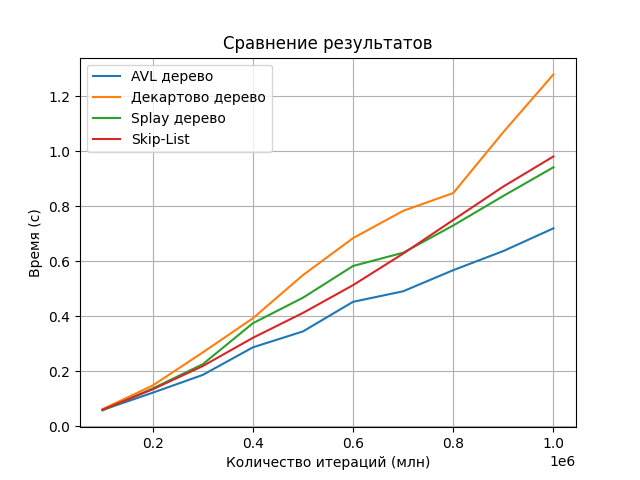
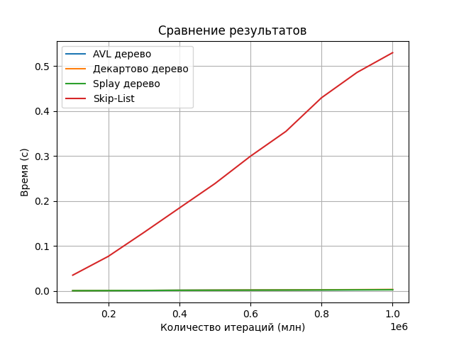
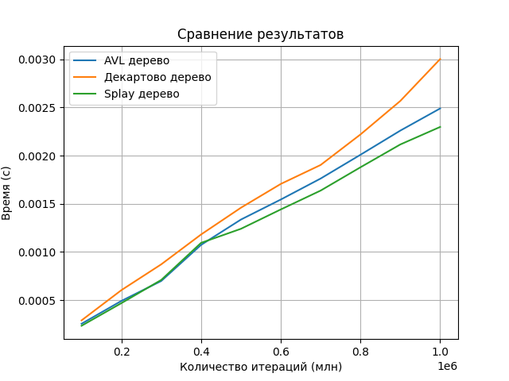

# Laba6

## Это шестая лаба по алгосам на тему "Деревья"

### Что было ~~дальше~~ сделано
Написана реализация наивного дерева поиска. Сделано 100000 вставок случайных элементов. Засечено время работы. Сделано 50000 удалений. Засечено время работы.

### Наивное дерево поиска
Binary Search tree - структура данных (aka двоичное дерево), для любого узла которого выполняются следующие свойства:

- Оба узла поддерева являются двоичными деревьями поиска;
- Все значения ключей левого поддерева меньше ключа узла;
- Все значения ключей правого поддерева больше ключа узла.

#### Результаты вставки и удаления случайных чисел
Время выполнения вставки: 0.031470 секунд
Время выполнения удаления: 0.020075 секунд

#### Результаты вставки и удаления отсортированной последовательности
Время выполнения вставки: 0.178969 секунд
Время выполнения удаления: 0.000053 секунд

### AVL-дерево
AVL-Tree — сбалансированное двоичное дерево поиска, в котором поддерживается следующее свойство:
- Для каждой его вершины высота её двух поддеревьев различается не более чем на 1.

#### Результаты вставки и удаления отсортированной последовательности
Время выполнения вставки: 0.004541
Время выполнения удаления: 0.000027

### Декартово дерево
Декартово дерево — это структура данных, сочетающая в себе двоичное дерево и двоичную кучу. Хранит пары (x, y), где для ключа x служит бинарным деревом поиска, а для приоритета y — двоичной кучей.

### Splay дерево
Splay-tree — это двоичное дерево поиска. Оно позволяет находить быстрее те данные, которые использовались недавно.

### Skip-List
Skip-List - вероятностная структура данных, основанная на нескольких параллельных отсортированных связных списках с эффективностью, сравнимой с двоичным деревом (порядка O(log n) среднее время для большинства операций).

### Вывод про вставку и удаление отсортированной последовательности:

### Результаты:
Вставка 10000 элементов в отсортированном порядке в наивное дерево поиска это долго и плохо, так как дерево превращается в структуру, напоминающую "бамбук". Каждый новый элемент добавляется как лист последнего узла, получается высота дерева становится равной количеству его элементов. Время вставки каждого нового элемента увеличивается, так как требуется пройти через все узлы дерева. Это делает общее время вставки всех элементов порядка $$ O(n^2) $$ , где n — количество вставок.

AVL-дерево, которое является сбалансированным двоичным деревом поиска, поддерживает свою структуру с балансировкой. Благодаря этому, высота AVL-дерева логарифм от количества вставленных значений. Таким образом, вставка 10000 отсортированных элементов займет времени порядка $$ O(n \log n) $$, что значительно эффективнее по сравнению с обычным двоичным деревом поиска.

Сравнение операции insert:

Сравнение операции delete:

Так как skip list слишком долгий, что не видно четко другие результаты, то вот график без него:

