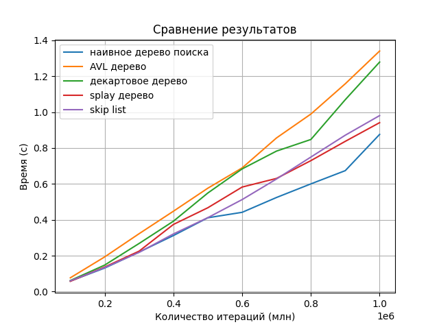
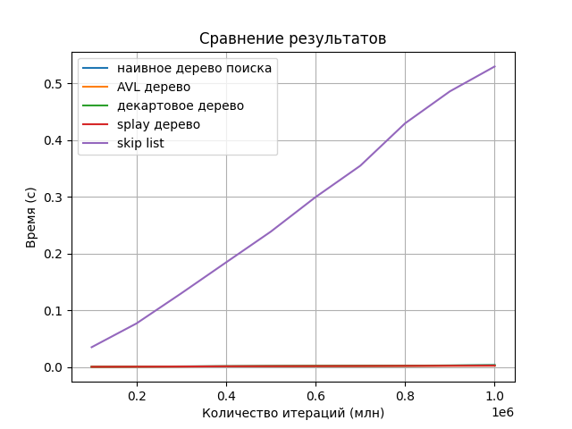
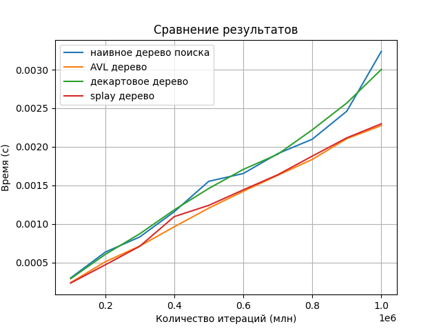

# Laba6

## Это шестая лаба по алгосам на тему "Деревья"

### Что было ~~дальше~~ сделано
Написана реализация наивного дерева поиска. Сделано 100000 вставок случайных элементов. Засечено время работы. Сделано 50000 удалений. Засечено время работы.

### Наивное дерево поиска
Binary Search tree - структура данных (aka двоичное дерево), для любого узла которого выполняются следующие свойства:

- Оба узла поддерева являются двоичными деревьями поиска;
- Все значения ключей левого поддерева меньше ключа узла;
- Все значения ключей правого поддерева больше ключа узла.

### AVL-дерево
AVL-Tree — сбалансированное двоичное дерево поиска, в котором поддерживается следующее свойство:
- Для каждой его вершины высота её двух поддеревьев различается не более чем на 1.

### Декартово дерево
Декартово дерево — это структура данных, сочетающая в себе двоичное дерево и двоичную кучу. Хранит пары (x, y), где для ключа x служит бинарным деревом поиска, а для приоритета y — двоичной кучей.

### Splay дерево
Splay-tree — это двоичное дерево поиска. Оно позволяет находить быстрее те данные, которые использовались недавно.

### Skip-List
Skip-List - вероятностная структура данных, основанная на нескольких параллельных отсортированных связных списках с эффективностью, сравнимой с двоичным деревом (порядка O(log n) среднее время для большинства операций).

Результаты:

Сравнение операции insert:

Сравнение операции delete:

Так как skip list слишком долгий, что не видно четко другие результаты, то вот график без него:

